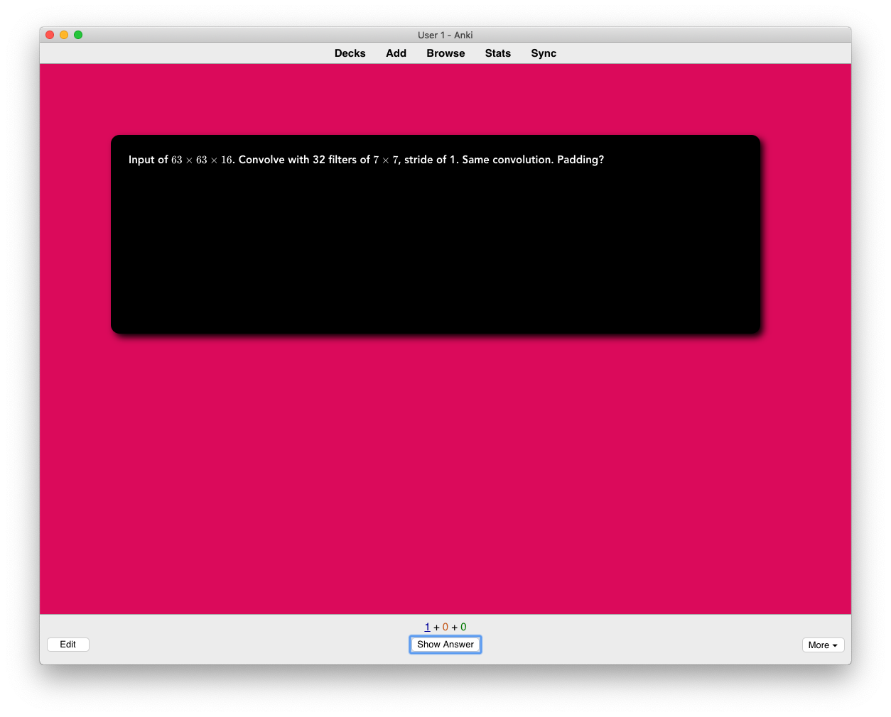
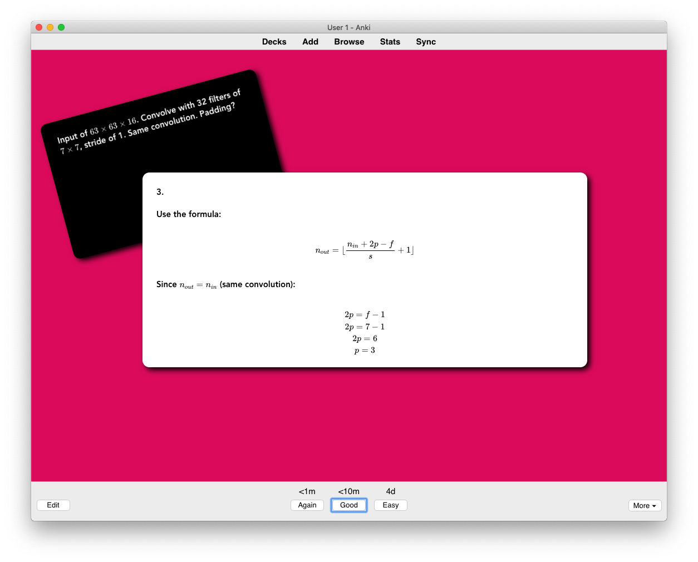

# Anki Customized Template

HTML and CSS to be inserted as a template (Basic) in [Anki](https://apps.ankiweb.net). 

This is how the question looks like:

And this is the answer:

## How to use

Add a new Note Type (`Tools > Manage Note Types`), then select it and click `Cards...`. 

Paste the content of `front.html` in the first field (*Front Template*).

Paste the content of `style.css` in the second field (*Styling*).

Paste the content of `back.html` in the last field (*Back Template*).